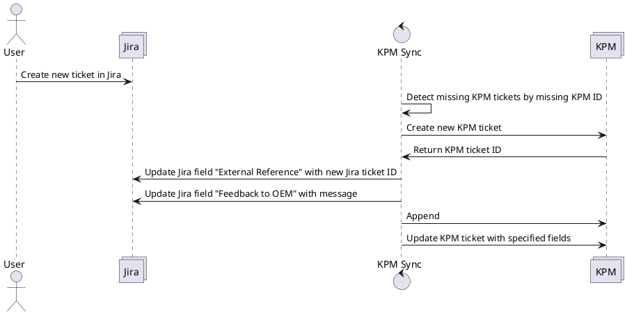

# Create new KPM ticket from new Jira ticket

## Overview



## Description
If a new ticket is created inside the Jira system, this ticket shall be created on the KPM system with minimal required fields as well.
After a successful creation of the Jira ticket into the KPM Ticket, the Jira ticket shall be updated to indicate a successful creation in KPM.
The Jira ticket shall be updated with a message inside the "Feedback to OEM" field.
The below specified fields have to be synced in a second step as well.

Precondition:

* Ticket exists in Jira
* Ticket does not exists in KPM

Postcondition:

* Ticket exists in Jira
* Ticket exists in KPM
* Minimal fields are added to KPM Ticket
* Jira Ticket is updated with KPM ID
* Jira Ticket is updated with Message
* The synchronization of defined fields needs to be triggered (automatically during the updated ticket)

## Technical Details

### Message for "Feedback to OEM"
```
[DD:MM:YYY] Ins System uebernommen.
```

### Fields to sync from jira to kpm

Create ticket approach:
* See PDF

Update ticket:
* Feedback from OEM
* Feedback to OEM
