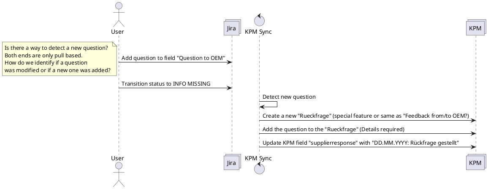

# Synchronize Supplier Response field

## Description
If a new question to the OEM is entered in the Jira ticket, the process of a "Rueckfrage" shall be opened on the KPM side. The "Rueckfrage" shall contain the body of the "Question to OEM" field.

## Questions

* How should the field names in Jira be exactly named? (Does not matter for the app, but for completeness and to avoid further confusion)
* How does the "Rueckfrage" process look like on KPM. How are the fields named, what exactly has to be done in which order. Please provide a manual demonstration.
* How to handle additional questions.

## Additional TODO

* Once the field name is clarified, this field needs to be added to Jira. (Can not be done by tooling team)