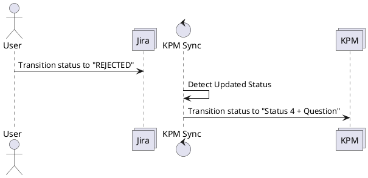

# Transition Jira ticket from possible state to rejected

## Overview

## Description
If an existing ticket is rejected on the Jira system, the status on the existing KPM ticket shall be updated as well.

## Questions

* What does "Staus 4 + Query" mean exactly?
* The PDF describes "Lieferantenaussage". Does this mean the field "Feedback to OEM"?
* The PDF describes "Query". Does this mean "Rueckfrage"?
* The PDF describes "Add "Reject -> siehe Liefernatenaussage" to Query". What is meant here?

