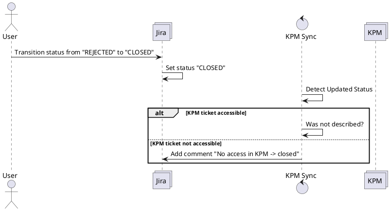

# Transition Jira ticket status from rejected to closed
## Overview

## Description
If an previously rejected ticket is closed on the Jira system, a comment on the Jira ticket should be added in case there is no access to the corresponding KPM ticket.

## Questions

* What should happen if there is access?
* If the state should be updated to KPM, to which value?
* Is there any case possible where a Jira ticket exists without KPM ticket (Since they are synced)?

