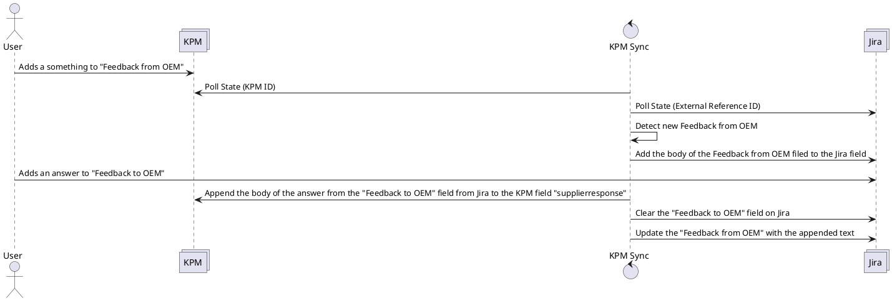

# Add feedback from OEM from KPM to the Jira filed "Feedback from OEM"

## Description
If a new answer is entered on the KPM system to an existing "Rueckfrage" process, this answer shall be added to the Jira ticket. Additionaly the status of the Jira ticket should automatically be changed from INFO MISSING to IN ANALYSIS.

## Questions

* How should the field names in Jira be exactly name? (Does not matter for the app, but for completeness and to avoid further confusion)
* How does the "Rueckfrage" process look like on KPM. How are the fields named, what exactly has to be done in which order. Please provide a manual demonstration.
* How to handle additional questions. TBC.

## Additional TODO

* Once the field name is clarified, this field needs to be added to Jira. (Can not be done by tooling team)