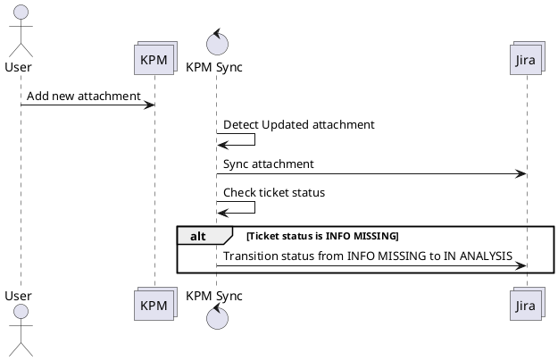

# Transition Jira ticket status from Info Missing to In Analysis

## Overview

## Description
If a new attachment is added to the KPM system, this ticket shall be synced to the Jira system. In addition to that the status of the Jira ticket shall be updated in case the status was on INFO MISSING.

## Questions

* What should happen if the ticket is in any other state?

