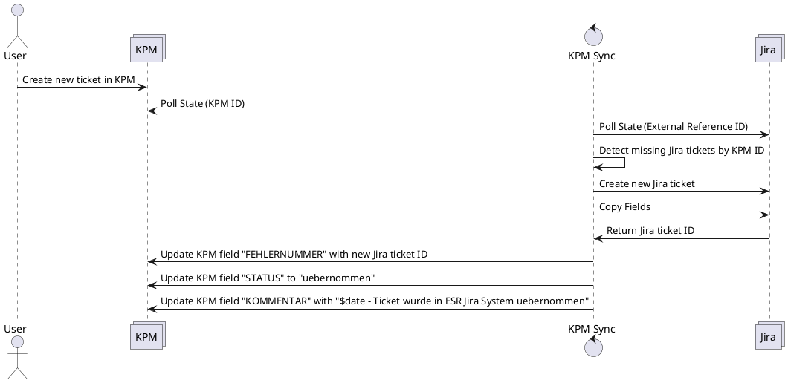

# Create new Jira ticket from new KPM ticket

## Overview

## Description
If a new ticket is created inside the KPM system, this ticket shall be created on the Jira system as well.
The below [specified](###fields-to-sync-from-kpm-to-jira) fields have to be synced as well. After a successful synchronization of the KPM
ticket into the Jira Ticket the KPM ticket shall be updated to indicated a successful transfer.

## Technical Details

### Fields to sync from kpm to jira
* Feedback from OEM

### Fields to update on KPM
* "FEHLERNUMMER" -> Jira ID of previously created ticket
* "STATUS" -> "uebernommen" (Is this the correct field in KPM?)
* "KOMMENTAR" -> "$date - Ticket wurde in ESR Jira System uebernommen" (Is this the correct field in KPM? - comment or "Feedback to OEM"/)
